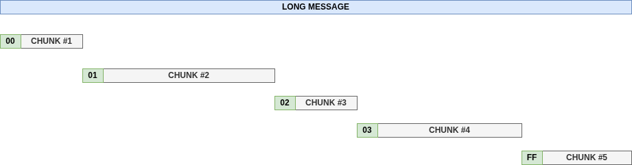

# DMFLib (Dynamic Message Fragmentation Library for Arduino)

## Introduction

When a message exceeds the maximum payload size of a single packet, it must be fragmented into multiple packets for transmission.
The receiver then reassembles these packets to reconstruct the original message.
Some protocols — such as LoRaWAN and MQTT-SN — require message fragmentation.

## Purpose

This ANSI-C library for Arduino simplifies the process of message fragmentation and reassembly.
The algorithm is illustrated in the following diagram:



## Features

Main features of the library:

- Fully written in **ANSI-C**;
- Only **1 additional byte** is added to each chunk to maintain ordering;
- Chunk size is **not fixed** and can change during fragmentation (useful in LoRaWAN communication with ADR);
- The **reassembler requires chunks to arrive in order**;
- **No checksum** added to the payload (e.g., CRC-32);
- **No padding** added to chunks;
- **No dynamic memory allocation** (`malloc`/`free`): the buffer must be allocated by the caller.

## Test

This library has been successfully tested on the following hardware:

  * [Arduino 2009 ATmega328P](https://docs.arduino.cc/retired/boards/arduino-duemilanove/)
  * [Arduino UNO R3](https://docs.arduino.cc/hardware/uno-rev3/)
  * [Raspberry PI Pico](https://www.raspberrypi.com/documentation/microcontrollers/pico-series.html)
  * [Espressif ESP8266-EX](https://www.espressif.com/en/products/devkits)
  * [Espressif ESP32-C3-13](https://www.espressif.com/en/products/devkits) 

## API Overview

---

## Fragmenter

**Initialization**

```c
fragmenter_t fragmenter;
fragmenter_init(&fragmenter, message, msg_len);
```

**Fragment the message**

```c
while (fragmenter_has_more(&fragmenter)) {
    uint32_t chunk_size = fragmenter_next(&fragmenter, chunk, max_chunk_size);
    ...
}
```

---

## Reassembler

**Initialization**

```c
reassembler_t reassembler;
reassembler_ret_code = reassembler_init(&reassembler, buffer, max_buffer_size);
```

**Reassemble the message**

```c
reassembler_ret_code = 0;
while (reassembler_ret_code != REASSEMBLER_COMPLETE) {
    reassembler_ret_code = reassembler_add_chunk(&reassembler, chunk, chunk_size);
    ...
}
```
